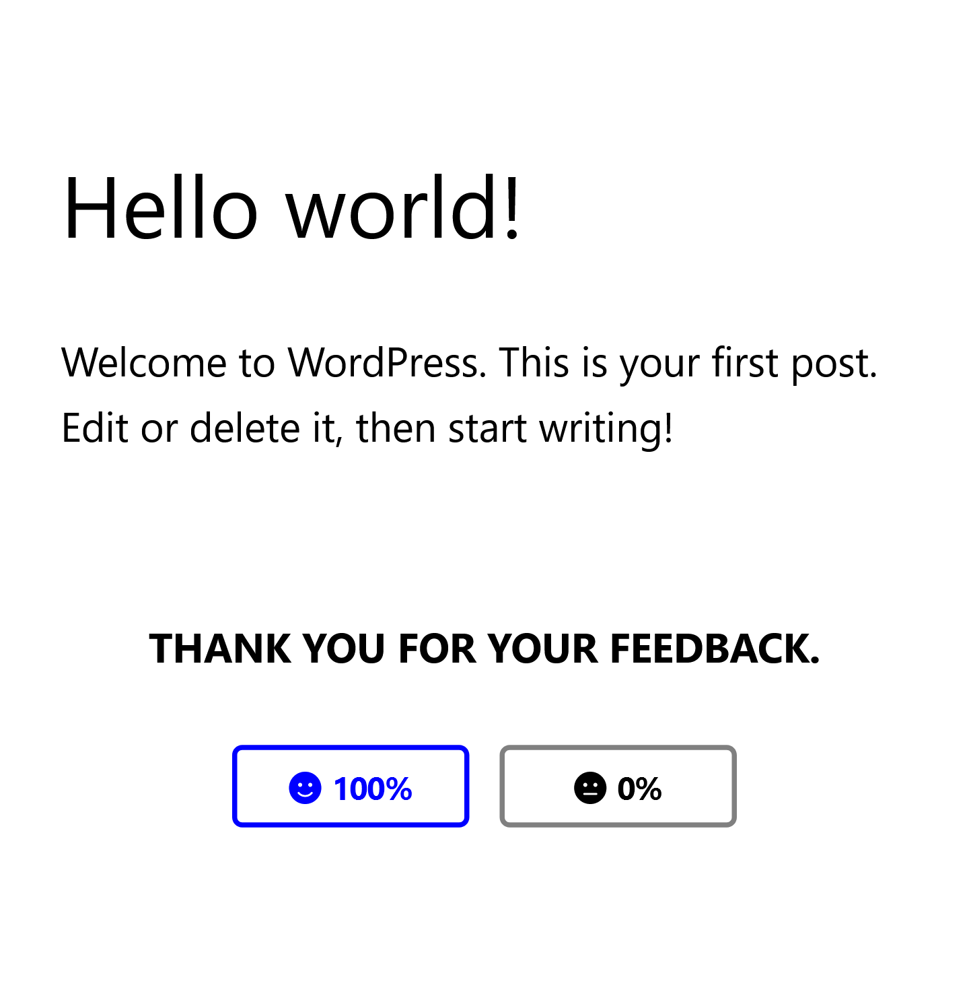

# Wordpress Feedback Plugin Sample

This is a sample plugin to demonstrate the functionalities of a post feedback mechanism as required by the assessment.





## Changes from the original repository

- Since WP-CLI and Composer were not working for me, I added a `Dockerfile` and modified the `docker-compose.yml` to install them.
- Added `bash` as the shell.
- Since I am using `composer`, autoload and vendor files are not gitignored for the time being to make it easy to install the plugin elsewhere.

## Notable Points / Inspirations

- Uses Composer for PSR-4 autoloading
- Uses various OOP methodlogies and PHPDoc
- Uses PHPUnit for unit testing
- Creation and deletion of a DB Table upon activation and decativation of the plugin
- i18n support
- Please note that the time constraints may have had an impact in the quality of the end result.
- Ran out of time to integrate a separate testing database

## Requirements
- Docker Desktop / Docker Compose
- PHP 8


## Configuration
- Copy `env.sample` to `.env` 
```
cp env.sample .env
```

- Run the docker containers
```
docker compose up -d
``` 

or `docker-compose up -d` if you are running an older version.


This creates two new folders next to your docker-compose.yml file.

- `wp-data` – used to store and restore database dumps
- `wp-app` – the location of your WordPress application

The containers are now built and running. You should be able to access the WordPress installation with the configured IP in the browser address. By default it is http://127.0.0.1.

For convenience you may add a new entry into your hosts file.

Changes the ports, if needed, by editing the docker-compose.yml file.

## Development

Shell into the docker container either with the UI or the terminal. Please check `Usage` below.

`cd` into the folder `wp-content/plugins/wp-feedback` and run `composer install`

You can now add more composer libraries if you want to.

#### Directories

The plugin comes with some easy to understand directories inside. 

- `src` This is where the PHP source code is located
- `assets` Place your JS, CSS or other static assets here
- `tests` Place the tests here


### Testing

In your docker container, cd into `wp-content/plugins/wp-feedback` and run `vendor/bin/phpunit`;

## Usage

### Starting containers

You can start the containers with the `up` command in daemon mode (by adding `-d` as an argument) or by using the `start` command:

```
docker-compose start
```

### Stopping containers

```
docker-compose stop
```

### Removing containers

To stop and remove all the containers use the`down` command:

```
docker-compose down
```

Use `-v` if you need to remove the database volume which is used to persist the database:

```
docker-compose down -v
```

### Creating database dumps

```
./export.sh
```

### Developing a Theme

Configure the volume to load the theme in the container in the `docker-compose.yml`:

```
volumes:
  - ./theme-name/trunk/:/var/www/html/wp-content/themes/theme-name
```

### Developing a Plugin

Configure the volume to load the plugin in the container in the `docker-compose.yml`:

```
volumes:
  - ./plugin-name/trunk/:/var/www/html/wp-content/plugins/plugin-name
```

### WP CLI

The docker compose configuration also provides a service for using the [WordPress CLI](https://developer.wordpress.org/cli/commands/).

Sample command to install WordPress:

```
docker-compose run --rm wpcli core install --url=http://localhost --title=test --admin_user=admin --admin_email=test@example.com
```

Or to list installed plugins:

```
docker-compose run --rm wpcli plugin list
```

For an easier usage you may consider adding an alias for the CLI:

```
alias wp="docker-compose run --rm wpcli"
```

This way you can use the CLI command above as follows:

```
wp plugin lists
```

### phpMyAdmin

You can also visit `http://127.0.0.1:8080` to access phpMyAdmin after starting the containers.

The default username is `root`, and the password is the same as supplied in the `.env` file.